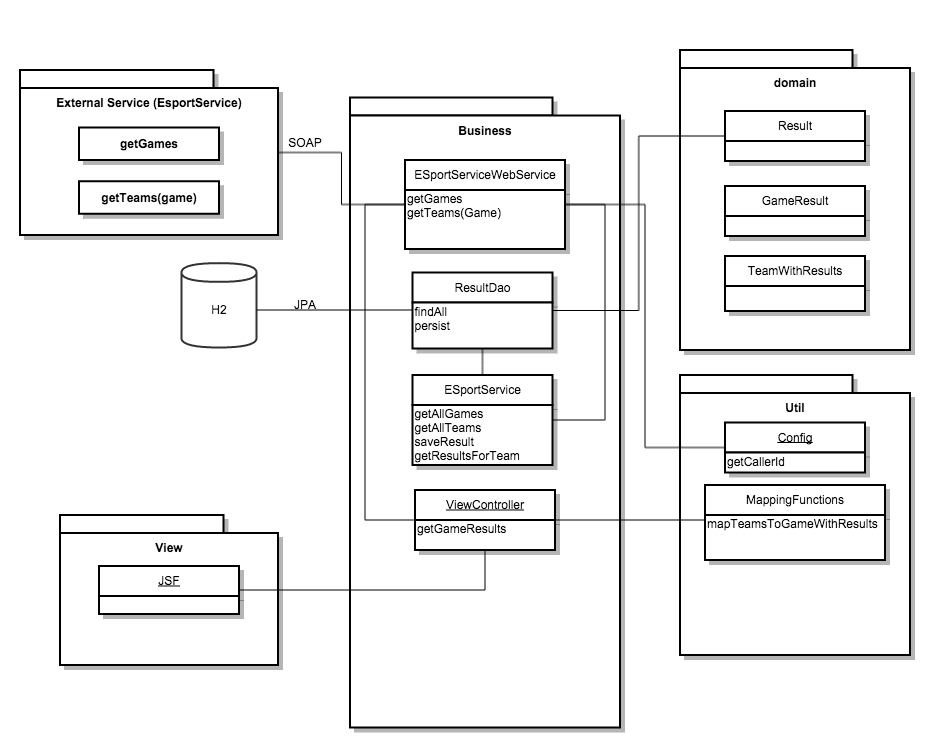

# PG6100-14 - Enterpriseprogrammering 2
|Name                    |Student number|Caller Id                           |
| ---------------------- |------------- |----------------------------------- |
|Simen Bekkhus - beksim10|700532        |6360A68A-D7D7-52FF-B8A0-16DC02CC01E9|
## Part 1 - Architecture
#### Task 7
|REST Service                         |URL                  |HTTP Verb|Input Data                                                       |
| ----------------------------------- | ------------------- |-------- | --------------------------------------------------------------- |
|Get all games                        |/esports/games       |GET      |-                                                                |
|Get all teams playing a specific game|/esports/teams/{game}|GET      |a `string` representing a game, e.g. `Hearthstone`               |
|Get all results                      |/esports/results     |GET      |-                                                                |
|Persist a new result                 |/esports/results     |POST     |an `object` containing 2 `integer`s, called `winner` and `loser` |
|Get a single result                  |/esports/results/{id}|GET      |an `integer` representing the id of a result                     |
A generated view of the interface may be found by deploying the application, and navigating to `beksim10-exam/swagger/index.html` on your server; e.g. `http://localhost:8080/beksim10-exam/swagger/index.html`. This allows you to test all the endpoints against a running application. Examples of `request`s and `response`s are also readily available.
######  A quick note about the Swagger documentation
Not everything in the samples are strictly correct. E.g. will `/esports/results` show
```
Result {
    id (integer, optional),
    winner (integer, optional),
    loser (integer, optional)
}
```
while it ideally should have displayed
```
Result {
    winner (integer, required),
    loser (integer, required)
}
```
The only problem I found was with the schemas, everything else worked correctly.
#### Task 8
##### 1


This got quite messy...
##### 2
A I have used is the traditional `MVC` Pattern. There is both a `REST` Controller and a View Controller (for JSF). These delegate to different beans providing business logic. There are some `DTO`s and a single `Entity` that is persisted, these represent the `Model`. The `View` is created using `JSF`.

Another pattern I tried to follow was `SOLID`. I split out logic into different beans, injecting them where needed. I also used an interface to the services provided by the WebService I integrated, to clean up the interface a bit.

Other patterns like `ACID` we get almost for free by using JPA.
##### 3
For the next version, the main areas of improvement would be the tests. The integration tests rely on both the state in the current DB, and the date from external systems. I'd have liked to spin up a seperate instance of `Wildfly` to have a clean environment for each test-run, in addition to mocking out the external dependency.

Another improvement would be to expand on the usage of `swagger`. It works now, but, as noted above, it's not perfect. I'd also like to move the sources of `swagger-ui` out of the source code, using maybe `webjars` or something similar.
## Part 2 - Theory
##### 1
`contract-first` means that you start out with a service contract, e.g. a `wsdl`-file, and generate code from it.  
`code-first` on the other hand, means that you generate the contract, e.g. a `wsdl`-file, from your code.

The advantages of `contract-first` are that it will generally lead to less tightly coupled code. As the contract is a separate entity, the likelihood of it changing as a bi-effect is lower. It also fosters a clear separation between the interface and its implementation.  
The advantages of `code-first` is mainly that it's easier to set up, as you just write the code, and the rest is generated. However, it's harder to keep the contract loosely coupled from the implementation.

In general, the normal way to go is `contract-first`. To avoid the initial setup, you can use code to generate the first draft of the contract then tweak it by hand. Maintaining a `wsdl`-file by hand wil generally make it cleaner and more user-friendly and, even though the syntax might be off-putting, there shouldn't be many changes in a contract, so that shouldn't be a problem.
##### 2
###### a
The difference between a unit test and an integration test is that a unit test will test the smallest unit possible, normally just a single method, and try to mitigate external factors, normally by mocking them. An integration test on the other hand, will try to run against an as true as possible version of the production environment, and mock as little as possible.  
Another difference is that, generally, a unit test should be very quick, running hundreds of tests should be done in second, so that you can run them all the time while making changes. Integrationtests are generally expected to be long running, and  are mostly for Continuous Integration servers to run.
###### b
In this project, I have divided the by suffixing the test classes with `IT`. This means that the maven `surefire`-plugin will skip executing them, but the `failsafe`-plugin will execute them during the `integrationtest`-phase.  
Technically, the difference between the two types in this project is that the integration tests either fire up their own `H2` database or are run against the running application deployed on `wildlfy`, while unit tests are run in the "traditional" way, mocking out external systems.
